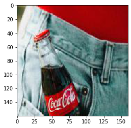

# SodaNet
The following repository hosts the soda-net modules which is a binary classifier for distinguishing whether a network contains soda bottles (in particular pepsi or coca-cola based products) over others. 

## Network Architecture

**Model: "sequential"**
_________________________________________________________________
Layer (type) | Output Shape | Parameters
--- | --- | ---
conv2d (Conv2D) | (None, 78, 78, 48) | 3648
max_pooling2d (MaxPooling2D) | (None, 39, 39, 48) | 0
conv2d_1 (Conv2D) | (None, 20, 20, 96) | 115296 
max_pooling2d_1 (MaxPooling2) | (None, 10, 10, 96) | 0
batch_normalization |  (None, 10, 10, 96) | 384
conv2d_2 (Conv2D) | (None, 5, 5, 192) | 460992
batch_normalization_1 | (None, 5, 5, 192) | 768
conv2d_3 (Conv2D)  | (None, 3, 3, 192) | 921792
max_pooling2d_2  | (None, 1, 1, 192) | 0
batch_normalization_2 | (None, 1, 1, 192) | 768
conv2d_4 (Conv2D) | (None, 1, 1, 256) | 1229056
batch_normalization_3 | (None, 1, 1, 256) | 1024
flatten (Flatten) | (None, 256) | 0
dense (Dense) | (None, 512) | 131584
dense_1 (Dense) | (None, 256) | 131328
dense_2 (Dense) | (None, 128) | 32896
dense_3 (Dense) | (None, 2) | 258     
_________________________________________________________________
Total params: 3,029,794
Trainable params: 3,028,322
Non-trainable params: 1,472
___________________________________________________________

## Usage

Method Name | #Inputs | Description
--- | --- | ----
get_model | None | Returns a copy of the model. 
set_model | Pytorch Model | Reinsantiates a new temporary model (optional, and usage limited to advanced exploration)
predict | None | Returns the predicted score (between 0 and 1) for a particular image or set of images. 
evaluate | csv file path (optional) | Returns a binary prediction alongside saving the results in the csv file if the csv path was set. 
retrain | folder path for positive, negative images for training | Retrains the network on user-defined images for a more hybrid and customized model
load_image | image variable (Preferable: numpy/cv2/Image) | Serves image to the network for making predictions
load_image_from_file | folder path containing image | Loads image from the folder to be served to the network for making predictions

## Usage Examples

```python

# Required packages (general)
from sodanet_model import SodaModel
from matplotlib.image import imread
from utilities import compute_accuracy_labelwise
# Required packages (demo-specific)
from matplotlib import pyplot as plt
```
```python
# Prediction from single image variable
image_path = 'dataset/temp_coke/5a86e60cd0307215038b4797.jpg'
im = imread(image_path)
plt.imshow(im)
```


```python
# Loading the sodanet module
model = SodaModel()
```
```python
# Making predictions for a single image variable
model.load_image(im)
predicted, im_ret = model.evaluate()
print (predicted) # 0: Not Coke, 1: Coke
plt.imshow(im_ret)
```


```python
# Resizing single files
import cv2
import os
import numpy as np

def  resize_image_single(im, output_shape=160):
resized = cv2.resize(im, (output_shape, output_shape), interpolation=cv2.INTER_AREA)
resized[resized<0] = 0
if resized.shape == (output_shape, output_shape, 4):
	resized = resized[:, :, :3]
	return cv2.normalize(resized, None, alpha = 0, beta = 255, norm_type = cv2.NORM_MINMAX, dtype = cv2.CV_32F).astype(n.uint8)
```
```python
# Prediction from multiple image variable
max_files = 10
base_path = 'dataset/temp_coke/'
files = os.listdir(base_path)[:max_files]
im = np.array([resize_image_single(imread(os.path.join(base_path, file))) for  file  in files])
model.load_image(im)
predicted, ret_im = model.evaluate()
print (predicted)
print ("Is returned img array same as the original ? : {}".format(np.testing.assert_almost_equal(im, ret_im) is  None))
```
[1, 1, 1, 1, 1, 1, 1, 1, 1, 1]
Is returned img array same as the original ? : True
```python

# Prediction for a batch of files
model.load_image_from_file('dataset/temp_not_coke')
results_tray = model.evaluate(output_csv_path='dataset/output/not_coke_pred.csv', mode='w')
print ("Rightly-classified Accuracy = {}".format(compute_accuracy_labelwise(results_tray, 1)))
print (results_tray)
```
** Rightly-classified Accuracy = 0.7352941176470589 ** 

{'2997084866_a6f8749434_o.jpg': 0, '3023311841_c26dac5dfd_o.jpg': 0, '3023311851_6f933bfb3a_o.jpg': 0, '3023311879_a4e284202b_o.jpg': 0, '3024147898_082442f05a_o.jpg': 0, '3025918647_703a4de870_o.jpg': 0, '3025918951_39b2fac429_o.jpg': 0, '3025919287_087cde93bf_o.jpg': 0, '3032125414_e77e60e493_o.jpg': 0, '3047846882_65e4b0f419_o.jpg': 0, '3065842898_ff98952f94_o.jpg': 0, '3078678794_1ae2993643_o.jpg': 0, '3079486385_075ce334e4_o.jpg': 0, '3096071435_3d8c5c7f82_b.jpg': 0, '3111310974_35fafc8cfc_o.jpg': 1, '3114872752_30e5a6f43c_o.jpg': 0, '3125757293_d556865120_o.jpg': 0, '3127159784_3488322034_o.jpg': 0, '3132900365_2cc23cc98f_o.jpg': 0, '3140832437_fc33e6d3ec_b.jpg': 0, '3143119042_91f7c1f11f_o.jpg': 1, '3156434046_6480916a26_o.jpg': 0, '3160363533_54090b3b49_o.jpg': 1, '3173971222_13dd6aeb8a_o.jpg': 1, '3195458229_a68d3a8bb6_o.jpg': 1, '3199401831_aab6d367bb_o.jpg': 1, '3233783186_9d3cfe89d8_o.jpg': 0, '3254549036_a53ed57449_o.jpg': 0, '3259183207_50611c73b0_o.jpg': 0, '3315899976_07c415ba41_o.jpg': 0, '3346111418_a7bec32df4_o.jpg': 0, '3350442226_d2a3f8859a_b.jpg': 0, '3353117567_e4af8600df_o.jpg': 1, '3358002940_f3b1ff97c9_o.jpg': 1, '3358006224_b497a55162_o.jpg': 0, '3366799719_6f16bbaa5e_o.jpg': 0, '3366801241_2231702f8e_o.jpg': 0, '3367626408_914eab3001_o.jpg': 0, '3380164579_215abe5f78_o.jpg': 0, '3381177647_6fb60ca8fd_o.jpg': 1, '3386622391_d600852ab4_b.jpg': 1, '3399444231_6c608344e0_b.jpg': 1, '3410569934_d1c899be0a_b.jpg': 0, '3412986513_7a54598b0b_o.jpg': 0, '3412990795_44a12602a2_o.jpg': 1, '3412994783_8ff4524ace_o.jpg': 1, '3413814050_ea2ba9479e_o.jpg': 0, '3413817524_8788120d2a_o.jpg': 0, '3414457036_0cc9f137ee_o.jpg': 1, '3420535396_bf8223e2a9_b.jpg': 0, '3424135421_6397fd9813_o.jpg': 0, '3426801723_5a4177abf2_b.jpg': 0, '3427865603_0fd209915b_b.jpg': 0, '3441073092_0e521a8cc4_o.jpg': 1, '3441603348_d250749f4d_o.jpg': 0, '3442080060_1b0831d72e_o.jpg': 0, '3454787946_2142cdeb08_o.jpg': 1, '3465976695_53ece28c46_o.jpg': 0, '3468692449_4c17bfd068_o.jpg': 0, '3474438200_236e584769_o.jpg': 0, '3477374004_7bc9ccca73_o.jpg': 0, '3489546892_4d036795fb_o.jpg': 0, '3499510376_b390155da9_o.jpg': 1, '3525495784_8f632743c2_o.jpg': 0, '3532881607_77749c22f4_b.jpg': 1, '3548999031_76c70824bd_o.jpg': 1, '3549807190_2448dce1d8_o.jpg': 0, '3558516335_6a5d408cdb_o.jpg': 0, '3561175329_61c6ba1f68_o.jpg': 0, '3563688060_416dd3ca94_b.jpg': 0, '3588908736_972cc1c5f9_o.jpg': 1, '3593355893_a52329d7f7_o.jpg': 1, '3593912700_e5704573b3_b.jpg': 0, '3609363287_2a698128fe_o.jpg': 0, '3617371187_4db81e2829_o.jpg': 0, '49055058851_205af72da7_o.jpg': 0, '49055069731_c6f6a3ff5a_o.jpg': 0, '49055075226_3ea9dd28e9_o.jpg': 1, '49055077416_6354256394_o.jpg': 0, '49055080836_40e6b1f781_o.jpg': 0, '49055208256_6ef6f8b357_o.jpg': 1, '49055274622_c93e272be4_o.jpg': 1, '49055278062_c72e7f6125_o.jpg': 0, '49055286312_2c38e70fb3_o.jpg': 1, '49062023763_e142edc32a_o.jpg': 0, '49062024248_022024b390_o.jpg': 0, '49062533366_c3f34235b3_o.jpg': 0, '49062753732_b10f28e290_o.jpg': 0, '49062754067_579d6fa6eb_o.jpg': 0, '49062754132_5bba64db9f_o.jpg': 0, '49062754152_9535c73351_o.jpg': 0, '49109019736_0b3969fc0d_o.jpg': 0, '49227706591_a65b2ce2ca_b.jpg': 0, '49242251823_ae4af2cd06_o.jpg': 1, '49254936012_6d4c3f7ccd_o.jpg': 0, '49260193652_ea4ef2924c_o.jpg': 0, '49277023143_93e5abfd51_b.jpg': 1, '49280641863_a2f6fb31d7_o.jpg': 0, '49298636643_d5bbfbe08a_o.jpg': 0, '49308027647_43d7624f80_b.jpg': 0, '49313487426_b1512b7223_o.jpg': 0, 'cutest-puppy-dog-pictures-coverimage.jpg': 0}

```python
model.load_image_from_file('dataset/temp_coke')
results_tray = model.evaluate(output_csv_path='dataset/output/coke_pred.csv', mode='w')
print ("Rightly-classified Accuracy = {}".format(compute_accuracy_labelwise(results_tray, 0)))
print (results_tray)
```
** Rightly-classified Accuracy = 1.0 **
{'0.jpg': 1, '1030426_d94dfc35f3_o.jpg': 1, '109941551_962c4dcdea_b.jpg': 1, '13294174925_d34609da50_o.jpg': 1, '138554565_77e5ae971c_b.jpg': 1, '142828186_ab849fa6b8_o.jpg': 1, '143461533_e74b0b57cb_o.jpg': 1, '1449043272_a08c71e89e_o.jpg': 1, '2104163582_7be25bd335_o.jpg': 1, '21134629_1d7b82c23d_o.jpg': 1, '2254092182_38bc0f543a_o.jpg': 1, '2311032877_0359c15594_o.jpg': 1, '2311740853_3da6eccb40_b.jpg': 1, '2319322997_99436373a7_o.jpg': 1, '2457317106_83248def25_o.jpg': 1, '2463336306_45c597c5a0_o.jpg': 1, '2477734502_ffd92fdd2f_o.jpg': 1, '2597104518_31bcd0cd21_b.jpg': 1, '260050723_3855b81f73_o.jpg': 1, '26126899_e4f864aeef_o.jpg': 1, '26526102405_ca4fa4f610_o.jpg': 1, '278349755_49dd1fe584_o.jpg': 1, '3045625277_7db5e52b9f_o.jpg': 1, '3045838110_f65e71548c_b.jpg': 1, '3069498736_f69e504cc5_o.jpg': 1, '311860160_58e4d23de0_b.jpg': 1, '31318321_dd3efab70b_b.jpg': 1, '3171541152_903ecbde34_b.jpg': 1, '3183042267_5a903f1d26_o.jpg': 1, '3213109439_d4c4e57a19_o.jpg': 1, '328489576_85355ea24c_o.jpg': 1, '3391259137_62e6647961_o.jpg': 1, '3398040819_28ced8a3cf_o.jpg': 1, '3403772837_eb02069f02_o.jpg': 1, '3404795297_2037b0c93a_o.jpg': 1, '3634821496_b5257a3439_b.jpg': 1, '36894042_82a8caea36_o.jpg': 1, '3890819650_dc8b19a187_o.jpg': 1, '4015409988_c1487da2a8_o.jpg': 1, '4115795471_3c9f1f3aee_o.jpg': 1, '4115796559_dfa6dd6a40_o.jpg': 1, '4172980506_7a7c311ba6_o.jpg': 1, '4226488034_6a92f2d4a4_o.jpg': 1, '441490116_7d1fc87f1d_b.jpg': 1, '473766110_e3e3fc9b30_o.jpg': 1, '474675206_84dcdc9e39_o.jpg': 1, '482485755_a4488e8602_o.jpg': 1, '490960656_033acd2c53_o.jpg': 1, '500244012_51ac583252_o.jpg': 1, '507855544_2b2088611a_o.jpg': 1, '508716043_7dbcc6944c_b.jpg': 1, '5a86e60cd0307215038b4797.jpg': 1, '5bc9c7c485600a7d0402ddb4.jpg': 1, '60842-15850565835461948_origin.jpg': 1, '81839131_bacfde92f6_o.jpg': 1, '8730087744_4ced3c6713_b.jpg': 1, '88587924_f06f3e1f48_o.jpg': 1, '9116465949_4d0b1e9051_b.jpg': 1, '9153523014_fc32f1b1ef_o.jpg': 1, '960x0.jpg': 1, '9864241_ac1b13b949_b.jpg': 1, 'Coca-cola_1040.jpg': 1, 'coke-corona-virus-today-main-200226-v2_1e37aa594870b85fc32b45d718978620.jpg': 1, 'Coke_PageProperties.jpg': 1}
```python

# Attempting to increase accuracy through training
dir_coke = 'dataset/temp_coke'
dir_not_coke = 'dataset/temp_not_coke'
validation_coke, validation_not_coke = '', ''
default_transformations_coke, default_transformations_not_coke = ['perform_random_affine_transform', 'flip_rotate', 'add_gaussian_noise'], []
model_params = {'max_epochs': 12, 'external_model_path': 'sodanet/additional_model'}
model.retrain(dir_coke, dir_not_coke, validation_coke, validation_not_coke, default_transformations_coke, default_transformations_not_coke, model_params)
```
Train on 2324 samples

Epoch 1/12

2324/2324 [==============================] - 35s 15ms/sample - loss: 0.2059 - accuracy: 0.9983

Epoch 2/12

2324/2324 [==============================] - 35s 15ms/sample - loss: 0.2028 - accuracy: 0.9996

Epoch 3/12

2324/2324 [==============================] - 34s 15ms/sample - loss: 0.2002 - accuracy: 0.9996

Epoch 4/12

2324/2324 [==============================] - 34s 15ms/sample - loss: 0.1976 - accuracy: 1.0000

Epoch 5/12

2324/2324 [==============================] - 35s 15ms/sample - loss: 0.1971 - accuracy: 1.0000

Epoch 6/12

2324/2324 [==============================] - 39s 17ms/sample - loss: 0.1970 - accuracy: 0.9996

Epoch 7/12

2324/2324 [==============================] - 36s 16ms/sample - loss: 0.1966 - accuracy: 1.0000

Epoch 8/12

2324/2324 [==============================] - 37s 16ms/sample - loss: 0.1963 - accuracy: 0.9996

Epoch 9/12

2324/2324 [==============================] - 38s 16ms/sample - loss: 0.1959 - accuracy: 1.0000

Epoch 10/12

2324/2324 [==============================] - 39s 17ms/sample - loss: 0.1955 - accuracy: 1.0000

Epoch 11/12

2324/2324 [==============================] - 38s 16ms/sample - loss: 0.1952 - accuracy: 1.0000

Epoch 12/12

2324/2324 [==============================] - 36s 15ms/sample - loss: 0.1949 - accuracy: 1.000
```python

# Prediction for a batch of files
model.load_image_from_file('dataset/temp_not_coke')
results_tray = model.evaluate(output_csv_path='dataset/output/not_coke_pred.csv', mode='w')
print ("Rightly-classified Accuracy = {}".format(compute_accuracy_labelwise(results_tray, 1)))
print (results_tray)
```

** Rightly-classified Accuracy = 0.9705882352941176 **

{'2997084866_a6f8749434_o.jpg': 0, '3023311841_c26dac5dfd_o.jpg': 0, '3023311851_6f933bfb3a_o.jpg': 0, '3023311879_a4e284202b_o.jpg': 0, '3024147898_082442f05a_o.jpg': 0, '3025918647_703a4de870_o.jpg': 0, '3025918951_39b2fac429_o.jpg': 0, '3025919287_087cde93bf_o.jpg': 0, '3032125414_e77e60e493_o.jpg': 0, '3047846882_65e4b0f419_o.jpg': 0, '3065842898_ff98952f94_o.jpg': 0, '3078678794_1ae2993643_o.jpg': 0, '3079486385_075ce334e4_o.jpg': 0, '3096071435_3d8c5c7f82_b.jpg': 0, '3111310974_35fafc8cfc_o.jpg': 0, '3114872752_30e5a6f43c_o.jpg': 0, '3125757293_d556865120_o.jpg': 0, '3127159784_3488322034_o.jpg': 0, '3132900365_2cc23cc98f_o.jpg': 0, '3140832437_fc33e6d3ec_b.jpg': 0, '3143119042_91f7c1f11f_o.jpg': 0, '3156434046_6480916a26_o.jpg': 0, '3160363533_54090b3b49_o.jpg': 0, '3173971222_13dd6aeb8a_o.jpg': 1, '3195458229_a68d3a8bb6_o.jpg': 0, '3199401831_aab6d367bb_o.jpg': 0, '3233783186_9d3cfe89d8_o.jpg': 0, '3254549036_a53ed57449_o.jpg': 0, '3259183207_50611c73b0_o.jpg': 0, '3315899976_07c415ba41_o.jpg': 0, '3346111418_a7bec32df4_o.jpg': 0, '3350442226_d2a3f8859a_b.jpg': 0, '3353117567_e4af8600df_o.jpg': 0, '3358002940_f3b1ff97c9_o.jpg': 0, '3358006224_b497a55162_o.jpg': 0, '3366799719_6f16bbaa5e_o.jpg': 0, '3366801241_2231702f8e_o.jpg': 0, '3367626408_914eab3001_o.jpg': 0, '3380164579_215abe5f78_o.jpg': 0, '3381177647_6fb60ca8fd_o.jpg': 0, '3386622391_d600852ab4_b.jpg': 0, '3399444231_6c608344e0_b.jpg': 0, '3410569934_d1c899be0a_b.jpg': 0, '3412986513_7a54598b0b_o.jpg': 0, '3412990795_44a12602a2_o.jpg': 0, '3412994783_8ff4524ace_o.jpg': 0, '3413814050_ea2ba9479e_o.jpg': 0, '3413817524_8788120d2a_o.jpg': 0, '3414457036_0cc9f137ee_o.jpg': 0, '3420535396_bf8223e2a9_b.jpg': 0, '3424135421_6397fd9813_o.jpg': 0, '3426801723_5a4177abf2_b.jpg': 0, '3427865603_0fd209915b_b.jpg': 0, '3441073092_0e521a8cc4_o.jpg': 0, '3441603348_d250749f4d_o.jpg': 0, '3442080060_1b0831d72e_o.jpg': 0, '3454787946_2142cdeb08_o.jpg': 0, '3465976695_53ece28c46_o.jpg': 0, '3468692449_4c17bfd068_o.jpg': 0, '3474438200_236e584769_o.jpg': 0, '3477374004_7bc9ccca73_o.jpg': 0, '3489546892_4d036795fb_o.jpg': 0, '3499510376_b390155da9_o.jpg': 0, '3525495784_8f632743c2_o.jpg': 0, '3532881607_77749c22f4_b.jpg': 0, '3548999031_76c70824bd_o.jpg': 0, '3549807190_2448dce1d8_o.jpg': 0, '3558516335_6a5d408cdb_o.jpg': 0, '3561175329_61c6ba1f68_o.jpg': 0, '3563688060_416dd3ca94_b.jpg': 0, '3588908736_972cc1c5f9_o.jpg': 0, '3593355893_a52329d7f7_o.jpg': 0, '3593912700_e5704573b3_b.jpg': 0, '3609363287_2a698128fe_o.jpg': 0, '3617371187_4db81e2829_o.jpg': 0, '49055058851_205af72da7_o.jpg': 0, '49055069731_c6f6a3ff5a_o.jpg': 0, '49055075226_3ea9dd28e9_o.jpg': 0, '49055077416_6354256394_o.jpg': 0, '49055080836_40e6b1f781_o.jpg': 0, '49055208256_6ef6f8b357_o.jpg': 0, '49055274622_c93e272be4_o.jpg': 0, '49055278062_c72e7f6125_o.jpg': 1, '49055286312_2c38e70fb3_o.jpg': 0, '49062023763_e142edc32a_o.jpg': 0, '49062024248_022024b390_o.jpg': 0, '49062533366_c3f34235b3_o.jpg': 0, '49062753732_b10f28e290_o.jpg': 0, '49062754067_579d6fa6eb_o.jpg': 0, '49062754132_5bba64db9f_o.jpg': 0, '49062754152_9535c73351_o.jpg': 0, '49109019736_0b3969fc0d_o.jpg': 0, '49227706591_a65b2ce2ca_b.jpg': 0, '49242251823_ae4af2cd06_o.jpg': 0, '49254936012_6d4c3f7ccd_o.jpg': 0, '49260193652_ea4ef2924c_o.jpg': 1, '49277023143_93e5abfd51_b.jpg': 0, '49280641863_a2f6fb31d7_o.jpg': 0, '49298636643_d5bbfbe08a_o.jpg': 0, '49308027647_43d7624f80_b.jpg': 0, '49313487426_b1512b7223_o.jpg': 0, 'cutest-puppy-dog-pictures-coverimage.jpg': 0}

```python
model.load_image_from_file('dataset/temp_coke')
results_tray = model.evaluate(output_csv_path='dataset/output/coke_pred.csv', mode='w')
print ("Rightly-classified Accuracy = {}".format(compute_accuracy_labelwise(results_tray, 0)))
print (results_tray)
```
** Rightly-classified Accuracy = 0.875 ** 

{'0.jpg': 0, '1030426_d94dfc35f3_o.jpg': 1, '109941551_962c4dcdea_b.jpg': 1, '13294174925_d34609da50_o.jpg': 1, '138554565_77e5ae971c_b.jpg': 1, '142828186_ab849fa6b8_o.jpg': 1, '143461533_e74b0b57cb_o.jpg': 1, '1449043272_a08c71e89e_o.jpg': 1, '2104163582_7be25bd335_o.jpg': 0, '21134629_1d7b82c23d_o.jpg': 0, '2254092182_38bc0f543a_o.jpg': 1, '2311032877_0359c15594_o.jpg': 1, '2311740853_3da6eccb40_b.jpg': 1, '2319322997_99436373a7_o.jpg': 1, '2457317106_83248def25_o.jpg': 1, '2463336306_45c597c5a0_o.jpg': 1, '2477734502_ffd92fdd2f_o.jpg': 1, '2597104518_31bcd0cd21_b.jpg': 1, '260050723_3855b81f73_o.jpg': 1, '26126899_e4f864aeef_o.jpg': 1, '26526102405_ca4fa4f610_o.jpg': 1, '278349755_49dd1fe584_o.jpg': 1, '3045625277_7db5e52b9f_o.jpg': 0, '3045838110_f65e71548c_b.jpg': 1, '3069498736_f69e504cc5_o.jpg': 1, '311860160_58e4d23de0_b.jpg': 1, '31318321_dd3efab70b_b.jpg': 1, '3171541152_903ecbde34_b.jpg': 1, '3183042267_5a903f1d26_o.jpg': 1, '3213109439_d4c4e57a19_o.jpg': 1, '328489576_85355ea24c_o.jpg': 1, '3391259137_62e6647961_o.jpg': 0, '3398040819_28ced8a3cf_o.jpg': 0, '3403772837_eb02069f02_o.jpg': 1, '3404795297_2037b0c93a_o.jpg': 1, '3634821496_b5257a3439_b.jpg': 1, '36894042_82a8caea36_o.jpg': 1, '3890819650_dc8b19a187_o.jpg': 1, '4015409988_c1487da2a8_o.jpg': 1, '4115795471_3c9f1f3aee_o.jpg': 1, '4115796559_dfa6dd6a40_o.jpg': 1, '4172980506_7a7c311ba6_o.jpg': 1, '4226488034_6a92f2d4a4_o.jpg': 1, '441490116_7d1fc87f1d_b.jpg': 1, '473766110_e3e3fc9b30_o.jpg': 1, '474675206_84dcdc9e39_o.jpg': 1, '482485755_a4488e8602_o.jpg': 1, '490960656_033acd2c53_o.jpg': 1, '500244012_51ac583252_o.jpg': 1, '507855544_2b2088611a_o.jpg': 1, '508716043_7dbcc6944c_b.jpg': 0, '5a86e60cd0307215038b4797.jpg': 1, '5bc9c7c485600a7d0402ddb4.jpg': 1, '60842-15850565835461948_origin.jpg': 1, '81839131_bacfde92f6_o.jpg': 1, '8730087744_4ced3c6713_b.jpg': 0, '88587924_f06f3e1f48_o.jpg': 1, '9116465949_4d0b1e9051_b.jpg': 1, '9153523014_fc32f1b1ef_o.jpg': 1, '960x0.jpg': 1, '9864241_ac1b13b949_b.jpg': 1, 'Coca-cola_1040.jpg': 1, 'coke-corona-virus-today-main-200226-v2_1e37aa594870b85fc32b45d718978620.jpg': 1, 'Coke_PageProperties.jpg': 1}